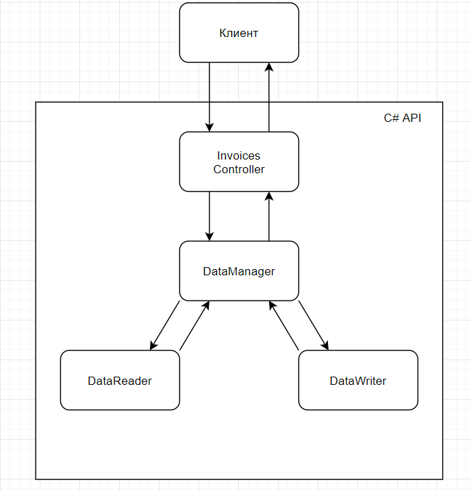

# Описание API
API создан с использованием ASP.NET Core 3.2

Сторонние библиотеки: CSV Helper

Общую структуру API можно описать следующей диаграммой

Описание диаграммы на примере получения списка всех счетов:
1. Клиент посылает Get запрос (при желании, в теле запроса можно передать параметры, например: статус обработки счета, номер счета от и до и т.д.)
2. Запрос попадает в соответствующий метод контроллера
3. Контроллер вызывает метод получения всех записей в DataManager (с передачей параметров, если такие были переданы)
4. Метод из DataManager проверяет полученные параметры (если были переданы)
5. DataManager обращается к DataReader, вызывая метод получения всех записей
6. DataManager фильтрует записи в соответствии с переданными параметрами (если были переданы)
7. DataManager возвращает в контроллер данные
8. Контроллер возвращает результат в зависимости от полученных данных

Такая структура была выбрана для разделения обязанностей между элементами, а именно:
1. DataReader - только чтение данных (возврат всех записей или одной конкретной), независимо от других задач (только чтение данных)
2. DataWriter - только запись данных (изменение или добавление записи)
3. DataManager - инкапсуляция всей работы с данными, аля фасад для DataReader и DataWriter с выполнением проверок
4. контроллер - только работа с запросом и вызов методов модели (DataManager), никаких проверок поступающих данных

Таким образом получаем удобную возможность для расширения и поддержки

По поводу структуры хранения классов модели:
В папке Models находятся 2 папки (HelperClasses и DataClasses) и файл DataManager (чтобы привлечь внимание к нему, дабы руки не чесались вызывать, например, методы DataReader в контроллере). В папке HelperClasses хранятся вспомогательные классы для DataManager (в данном случае DataReader и DataWriter). В папке DataClasses хранятся классы и структуры не выполняющие каких-либо действий, например Invoce (класс счета), PaymentMethod (структура, тип счета), PageParams (параметры страницы, аля количество получаемых записей и параметры фильтрации)
